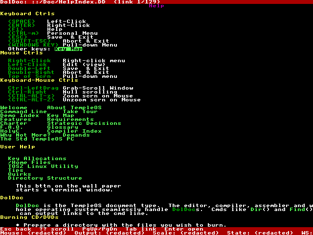
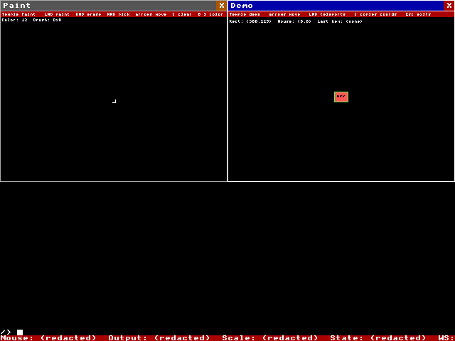
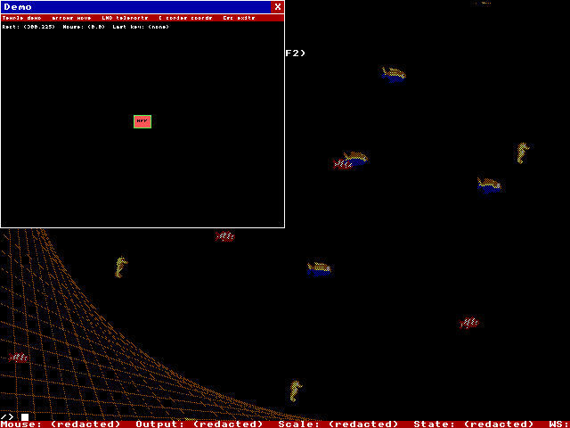

# TempleLinux

TempleLinux is a TempleOS-inspired environment for Linux: a full-screen “Temple” UI that aims for TempleOS-like visuals (palette, font, DolDoc, sprites) while running on a normal Linux desktop.

This repo vendors upstream TempleOS sources under `third_party/TempleOS/` and focuses on running representative, unmodified HolyC programs inside `templeshell`.

If you cloned without submodules, run:

```bash
git submodule update --init --recursive
```

## What is TempleLinux? (deep overview)

TempleLinux is a Linux-native software stack that tries to recreate the **TempleOS “feel”** (palette, 8×8 font, DolDoc documents, sprite-heavy UI conventions, lightweight apps) **without running the TempleOS kernel**.

Instead of virtualizing or emulating the operating system, TempleLinux focuses on **source-level compatibility**:

- TempleOS programs are executed from their **HolyC source** (primarily from the vendored TempleOS tree).
- A small, practical subset of the TempleOS API is implemented and mapped onto a Linux-hosted runtime.
- A full-screen graphical shell (“TempleShell”) renders to a **fixed internal framebuffer** (currently **640×480**) and scales it with **nearest-neighbor** to keep pixels crisp.
- Linux remains “real” underneath: the compositor, drivers, packages, browser, editor, etc. are normal Linux programs—optionally living on a separate workspace.

This repo’s scope is explicitly “TempleOS apps + aesthetics on Linux”, not “TempleOS as an OS”.

### What this project is (and isn’t)

TempleLinux is best thought of as a **TempleOS-flavored runtime + UI environment** hosted by Linux:

- **A graphical shell** (`templeshell`) that draws a TempleOS-like screen and hosts a minimal “Temple app” windowing model.
- **A HolyC runtime** (`temple-hc`) that can compile and execute a useful subset of HolyC used by real TempleOS demos/apps.
- **A compatibility layer** that implements a subset of TempleOS APIs (graphics, input/messages, docs, filesystem, sound).
- **A shared protocol + runtime** (`temple_rt`) used by HolyC and Rust apps to draw into a TempleShell-managed framebuffer via IPC.
- **A vendored upstream TempleOS source tree** (git submodule) used as the canonical “app and asset corpus” (`third_party/TempleOS/`).

TempleLinux is not:

- The TempleOS kernel or boot process.
- A full machine emulator or VM image.
- A binary compatibility layer for TempleOS binaries/ISOs.
- A “theme pack” that just skins a Linux terminal.

### How it works (high-level)

#### Rendering model: TempleOS-like pixels on a modern desktop

`templeshell` maintains a fixed-size internal framebuffer (**640×480**). All UI logic runs in that coordinate system and is scaled to your monitor/window with nearest-neighbor sampling. A 4:3 aspect ratio is preserved via letterboxing so the output isn’t distorted.

This “fixed internal buffer + nearest scaling” is the core trick that makes the output look like TempleOS rather than “a modern app pretending”.

#### Temple apps + IPC

Temple apps (HolyC programs via `temple-hc`, or native Rust demo apps) connect to `templeshell` over a Unix-domain socket (`TEMPLE_SOCK`).

- `templeshell` hosts the IPC server.
- Each app gets a shared-memory framebuffer (via `memfd` + FD passing).
- Keyboard/mouse input is forwarded to the focused app.
- Apps draw/present frames and receive events through the shared protocol (`temple_rt::protocol`).

This keeps the “Temple workspace” UI in one place while letting Temple apps run out-of-process.

#### HolyC execution strategy

The compatibility strategy is source-level:

- Programs are loaded from the TempleOS tree (e.g. `::/Demo/.../*.HC`) or from the user’s writable Temple root (e.g. `/Home/...`).
- `temple-hc` interprets/executes a subset of HolyC sufficient to run a representative set of upstream TempleOS demos/apps.
- Where upstream programs assume a TempleOS environment, TempleLinux implements the needed “OS-like” functions as built-ins and grows coverage based on real programs.

#### Linux integration (“dual-OS” feel)

TempleLinux keeps Linux “real”:

- Inside TempleShell, commands like `browse`, `open`, and `run` can launch Linux apps via `xdg-open` / process spawning.
- In the dedicated session mode, TempleShell is intended to stay full-screen on workspace 1 while Linux apps live on workspace 2 (see `packaging/bin/templelinux-session`).

### Where data lives

- `TEMPLE_ROOT` (writable “Temple drive”)
  - Default: `$HOME/.templelinux`
  - Contains: `Home/`, `Doc/`, `Cfg/`, `Apps/`
- `TEMPLEOS_ROOT` (read-only upstream TempleOS tree)
  - Auto-discovery:
    - a nearby `third_party/TempleOS/` (repo/submodule), or
    - `/usr/share/templelinux/TempleOS` (system-wide install)

More detail: `research.md`, `plan.md`, and `COMPATIBILITY.md`.

## Screenshots

<p>
  
  
</p>

<p>
  
  
</p>

More screenshots: `docs/screenshots/2026-02-15/`

## Smoke tests

- Protocol-level: `cargo test -q`
- GUI goldens (headless/Xvfb): `TEMPLE_GUI_TESTS=1 cargo test -q --test gui_smoke`

See `COMPATIBILITY.md` for the current compatibility target + smoke suite definition.
